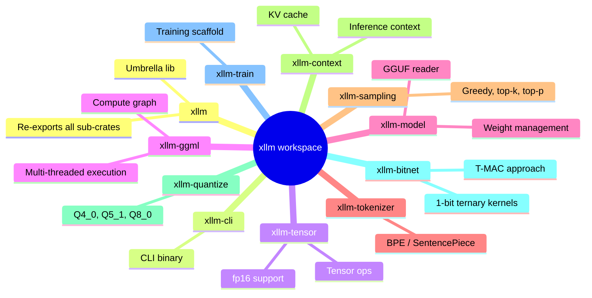
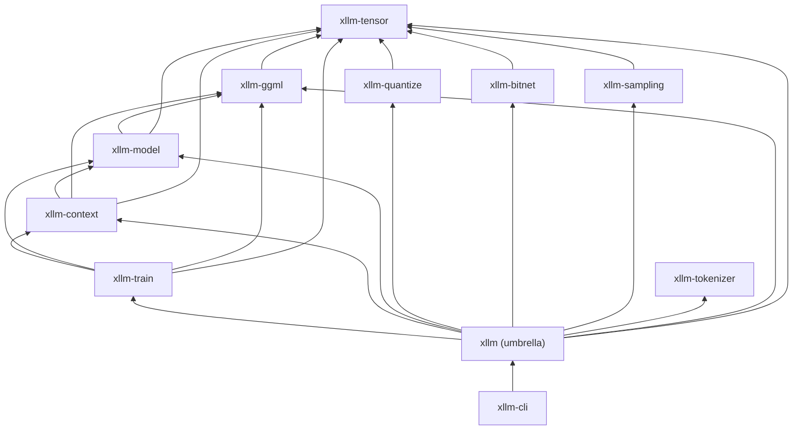
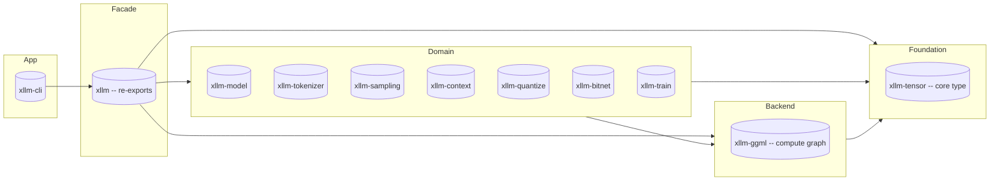
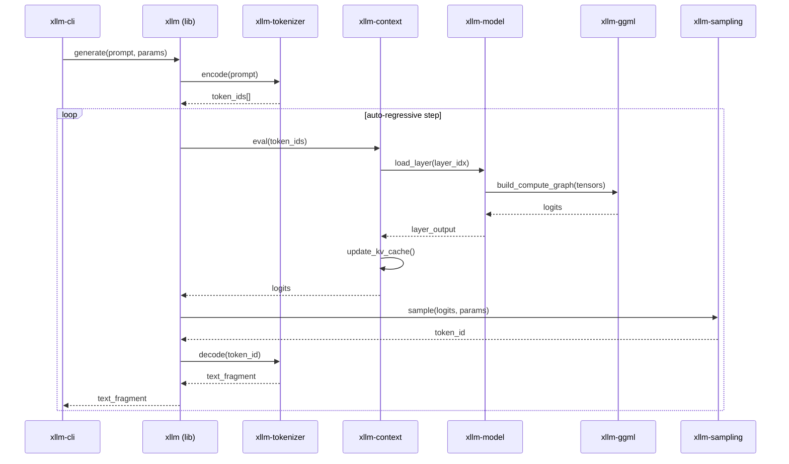
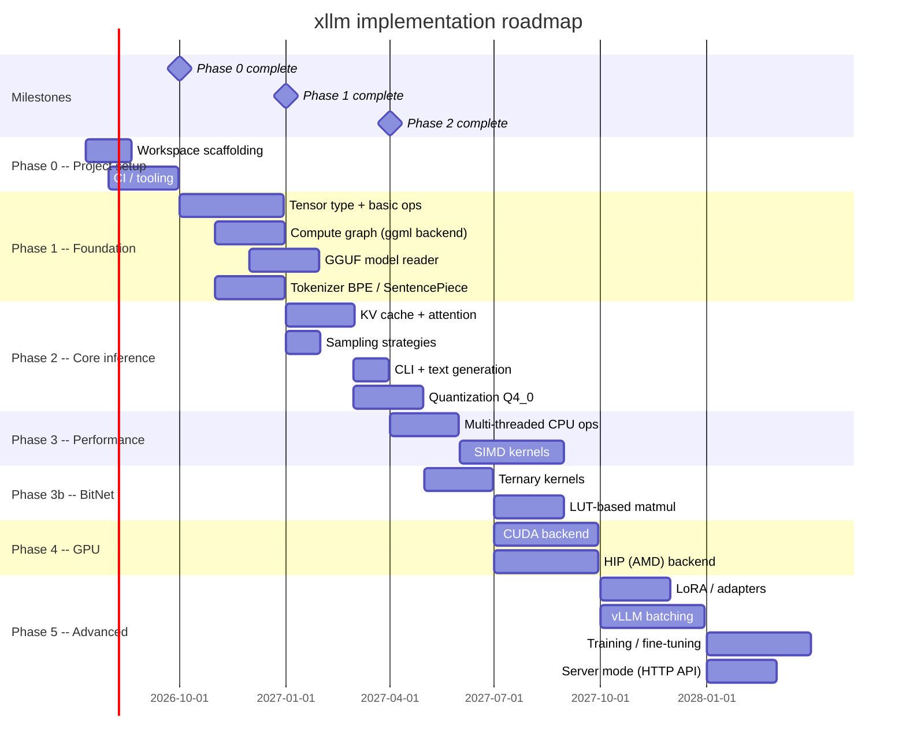

# xllm Architecture

## Overview

xllm is a CPU-first LLM inference engine written in Rust, porting the
[llama.cpp](https://github.com/ggml-org/llama.cpp) design. It structures
functionality into independently versioned crates, maximising reusability and
compile-time isolation.

## Guiding principles

- **TDD**: Test first, implement, refactor.
- **CPU-first**: CPU inference first; GPU (CUDA/HIP) behind optional feature flags.
- **Security-first**: `thiserror` in libraries, `anyhow` in binaries, no
  unwrap/expect on external input.
- **No unsafe code**: The `unsafe_code = "deny"` lint is set workspace-wide.
  Zero `unsafe` blocks, functions, or traits are permitted.
- **KISS, DRY, YAGNI, TDA, SOLID**.
- **Nightly Rust**: Edition 2024, newest language features.

---

## Workspace structure

The root `Cargo.toml` is a virtual workspace. Eleven crates live under
`crates/`:

---

## Crate dependency graph

Arrows point from dependant to dependency:

`xllm-tensor` is the sole leaf crate -- every domain crate depends on it.

---

## Layered architecture

---

## Inference pipeline

The data flow through a single generation step:

---

## External dependencies

| Dependency | Used by | Purpose |
| ---------- | ------- | ------- |
| `half` 2 | `xllm-tensor` | fp16 (half-precision) tensor storage |
| `byteorder` 1 | `xllm-model`, `xllm-tokenizer` | Binary file format reading (GGUF, BPE) |
| `memmap2` 0.9 | `xllm-model` | Memory-mapped file I/O for model weights |
| `rayon` 1 | `xllm-ggml` | Multi-threaded parallel computation |

GPU backends (`cudarc`, `hip-rs`) will be added behind feature flags in
Phase 4.

---

## Implementation phases

---

## Key design decisions

| Decision | Rationale |
| -------- | --------- |
| Follow llama.cpp API | Reuse knowledge, tools, and model files from the ecosystem |
| CPU-first, GPU behind feature flags | Keep core simple; GPU is an optimisation layered on top |
| `thiserror` for lib, `anyhow` for bin | Idiomatic Rust error handling; library errors are domain types |
| Unsafe code forbidden | `unsafe_code = "deny"` workspace-wide; zero unsafe code permitted |
| Nightly Rust | Edition 2024 features, async support, and newest language capabilities |
| GGUF file format | Full compatibility with the llama.cpp model ecosystem |
| BitNet b1.58 backend | Pure integer add/sub matmul -- no floating-point multiplications, massive CPU speedup |
| Virtual workspace | Independent versioning, faster compilation, cleaner dependency isolation |

---

## Configuration

All shared metadata lives in the root `Cargo.toml`:

- `[workspace.package]` -- edition, license, version.
- `[workspace.lints.rust]` -- lint policy (warnings-as-errors).
- `[workspace.dependencies]` -- shared external and internal dependencies.

Build profiles and target-specific linker flags are in `.cargo/config.toml`.
Rust toolchain is pinned via `rust-toolchain.toml` (stable).

---

## Testing strategy

- **Unit tests**: Inline `#[cfg(test)] mod tests` in every crate.
- **Integration tests**: End-to-end model loading and inference.
- **Benchmarks**: `cargo bench` for performance-sensitive operations.
- **Property-based**: `proptest` or `quickcheck` for tensor operations.
- **Fixtures**: Small test models (tiny GGUF, tokenizer test data).
